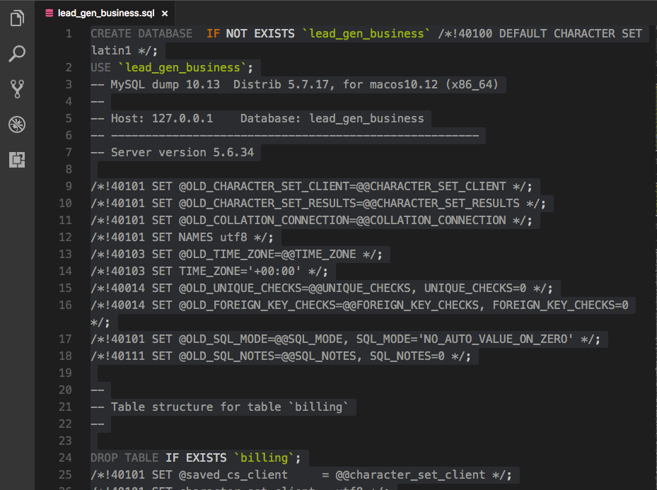
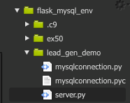
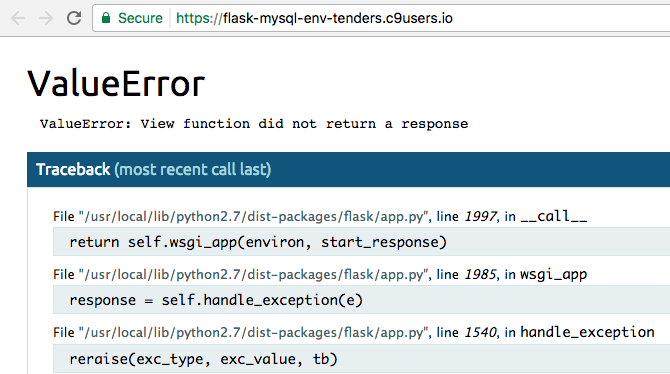
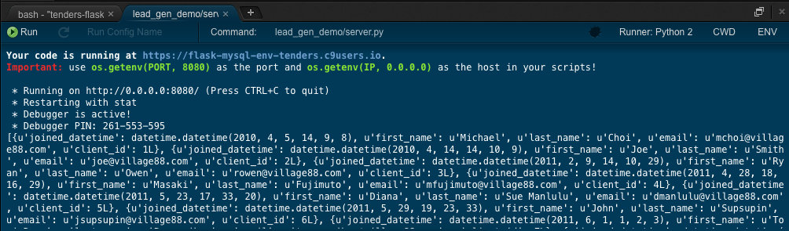
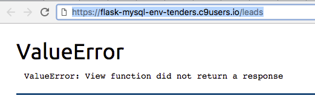

#### Sign up for Cloud 9 at c9.io

#### Create a new Workspace
- Fill in your workspace's information. I'd name it something like `flask_mysql`  
You might be wondering if you should have a separate workspace per assignment on the platform.  
You can do what suits you best.  These instructions will show you how you can run a single app at a time, 
so it's possible to have a directory per assignment as well.
- Choose to keep the workspace Public
- Choose Python as your technology (not Django)

#### Once the C9 server finally procures and launches a Python-packed Ubuntu server for you...
- You'll be shown what looks like a normal IDE (think: Atom, Sublime, VS Code)
- The terminal in the bottom is a bash terminal, just like you'd see on your Mac
- We're working within a Ubuntu machine, which for our purposes, isn't much different from the Mac
- You can navigate in the terminal with commands like `ls` `cd`, etc. Except now your only folder structure is what you see in the left pane
- Feel free to get a feel of this terminal. Run `pip list` and see what Python tools are at your fingertips already.
- All the nooks and crannies of Python are here, except what we're after, which is Flask, MySQL-Python and Flask-SQLAlchemy
- `sudo pip install flask` will install flask globally to this Ubuntu machine.  We'll get away from virtual environments for now.  Think of this entire machine as your stand-alone environment.
- Next we'll install a MySQL server.  `mysql-ctl cli` will not only install mysql to the Ubuntu machine, but also start the server and give you a prompt.  For now, exit the prompt. `exit`
- `sudo pip install MySQL-python` and finally `sudo pip install Flask-SQLAlchemy`
- We now have Flask, MySQL, MySQL-Python and Flask-SQLAlchemy on our machine. Sweet!

#### More Workbench + Terminal Work
- Remember how we installed MySQL a moment ago? We're going to need to get more comfortable with our tech skills and work through the terminal more.
- You've already learned how to build ERDs with MySQL Workbench.  Continue to do so when you are building brand new schemas for all your assignments.  Except now, you're going to need to do one of three things...

##### IF you are starting fresh and just created an ERD.  Our goal is to forward engineer your ERDs, so we need to copy or save your SQL Creation File. Need a refresher?
- If your Workbench version doesn't allow you to do a simple Forward Engineer choice from the Database dropdown, simply go to File > Export > Forward Engineer SQL CREATE script...
- This will open a prompt designed to show you your database build code.  Save your .sql file on the first prompt or skip and get to the screen with the SQL code on it.  Select ALL and copy it.
- Now head back to your browser where you have Cloud 9 open and skip down to `THE MYSQL PROMPT AREA`...

##### IF you're using an existing schema you've forward engineered in the past and want to use it
- [These instructions are also in the Import/Export tabs in the learning platform]
- Make sure MAMP is running on your local machine to do the following in Workbench...
- After selecting a connection (and logging in with root/root), go into the Server menu at the top, choose Data Export. Select the lead_gen_business database if you just want to follow along with this walk-through.
- Now select the option to export into a self-contained file.  Click the ... button to change where you save this file and how you name it (for demo purposes, name it lead_gen_business.sql).  Desktop is good enough for now.
- Next make sure to check the box that says Include Create Schema
- Finally, click Start Export
- Close this tab in Workbench and go to your Desktop to find the lead_gen_business.sql file
- Open lead_gen_business.sql in your local text editor (Atom or Sublime,etc.) and copy the entire SQL code.
- Head back to Cloud 9 in your browser and jump down to the info about the mysql prompt.

##### IF you have a sql file in hand, such as or have a SQL file ready to go, such as the Lead_Gen_Business Database (found here:[sql file](http://s3.amazonaws.com/General_V88/boomyeah/company_209/chapter_3569/handouts/chapter3569_5435_lead-gen-business-new.sql)), and need to transfer the SQL Code as it stands now...
- Find your sql file and open it in a text editor. It might look something like below...



- Copy the entire SQL code and head back to Cloud 9 in your browser and move onto the mysql prompt section below

#### To the mysql prompt!
- The `mysql-ctl cli` command from the Ubuntu bash terminal opens a command line interface with our mysql database server.  Run that command to get to the `mysql>  ` prompt.
- Now, go ahead and paste in the SQL code you either copied from Workbench a few moments ago or copied out of your text editor (in the lead_gen_business.sql example above).
- If you're doing the Lead Gen Business DB walk-through, it's going to take some time to run all those SQL commands.  But we know it's working!
- The thing to make note of is the *NAME* of the database in the first line of the SQL code.  This is our database name we need for the mysqlconnection.py file!
- If you have trouble locating this, you can always check what databases are available to you by doing `show databases;` in the mysql prompt.  Hopefully you see the database you want to use.
- Great, let's exit the mysql prompt `exit` and move on now that we have a database ready!

#### Customizing the mysqlconnection.py File

A couple things are different from what we supplied on the platform in regards to the connection file.
```python
from flask_sqlalchemy import SQLAlchemy
from sqlalchemy.sql import text
# Create a class that will give us an object that we can use to connect to a database
class MySQLConnection(object):
    def __init__(self, app, db):
        config = {
                'host': 'localhost',
                'database': db, # we got db as an argument
                'user': 'root',
                'password': '',
                'port': '3306' # change the port to match the port your SQL server is running on
        }
        # this will use the above values to generate the path to connect to your sql database
        DATABASE_URI = "mysql://{}:{}@127.0.0.1:{}/{}".format(config['user'], config['password'], config['port'], config['database'])
        app.config['SQLALCHEMY_DATABASE_URI'] = DATABASE_URI
        app.config['SQLALCHEMY_TRACK_MODIFICATIONS'] = True
        # establish the connection to database
        self.db = SQLAlchemy(app)
    # this is the method we will use to query the database
    def query_db(self, query, data=None):
        result = self.db.session.execute(text(query), data)
        if query[0:6].lower() == 'select':
            # if the query was a select
            # convert the result to a list of dictionaries
            list_result = [dict(r) for r in result]
            # return the results as a list of dictionaries
            return list_result
        elif query[0:6].lower() == 'insert':
            # if the query was an insert, return the id of the
            # commit changes
            self.db.session.commit()
            # row that was inserted
            return result.lastrowid
        else:
            # if the query was an update or delete, return nothing and commit changes
            self.db.session.commit()
# This is the module method to be called by the user in server.py. Make sure to provide the db name!
def MySQLConnector(app, db):
    return MySQLConnection(app, db)
```
- Note the config dictionary at the top.  The user is root, there is no password and the port is 3306.  These are the defaults of your Ubuntu machine. Please don't alter them.
- Now you'll want to finally make a folder on your Ubuntu machine to place this mysqlconnection.py file in.
- From the bash terminal run `mkdir lead_gen_demo` which will yield...
    - flask_mysql/
        - .c9/
        - ex50/
        - lead_gen_demo/
- Right-click the lead_gen_demo folder and select New File... and copy/paste the code above into a file called mysqlconnection.py
- ALMOST THERE!
- Now, create another file called server.py in the same folder.  Check out the alterations to this file now...

```python
import os # this is new!!
# import the Connector function
from mysqlconnection import MySQLConnector
from flask import Flask
app = Flask(__name__)
# connect and store the connection in "mysql" note that you pass the database name to the function
mysql = MySQLConnector(app, 'lead_gen_business') # remember the database name from earlier?!
# an example of running a query
@app.route("/")
def index():
    print mysql.query_db("SELECT * FROM clients")

app.run(debug=True, host=os.getenv('IP', '0.0.0.0'), port=8080) 
```

Here's the resulting folder structure:



- Now, technical jargon aside, we want to launch this and see if we can actually send a get request to "/" like we're used to from our Flask days.
- But we've got to somehow get Cloud9 to run server.py for us and we have to know how to navigate there!
- Never fear.  The extra code in the `app.run` line helps us out.
- Next step: right-click on the server.py file in the left pane and select Run
- This is launching the app and your bash terminal will show you the normal Flask stats, and also the URL to use to get there in another browser tab.
```
Your code is running at https://flask-mysql-env-tenders.c9users.io.
Important: use os.getenv(PORT, 8080) as the port and os.getenv(IP, 0.0.0.0) as the host in your scripts!

 * Running on http://0.0.0.0:8080/ (Press CTRL+C to quit)
 * Restarting with stat
 * Debugger is active!
 * Debugger PIN: 261-553-595
```
- Copy this URL where it says `Your code is running at https://xxxx-xxxxx-xxxxxx.c9users.io` and paste it into a new browser tab!



- Go back to your Cloud 9 bash terminal to see what happens! Hopefully you see Python errors like the ones above in the browser (we aren't returning a response) and then a boat load of query results in the terminal!



- The important thing to note here is that the Cloud9 url we pasted into the browser is acting like our localhost.  So if we wanted to set up a route in server.py to accept a GET request to /leads, we can do that like we normally would!  No need to worry about the Cloud9 URL business.

```python
import os # this is new!!
# import the Connector function
from mysqlconnection import MySQLConnector
from flask import Flask
app = Flask(__name__)
# connect and store the connection in "mysql" note that you pass the database name to the function
mysql = MySQLConnector(app, 'lead_gen_business') # remember the database name from earlier?!
# an example of running a query
@app.route("/")
def index():
    print mysql.query_db("SELECT * FROM clients")

@app.route("/leads")
def get_leads():
    print mysql.query_db("SELECT * FROM leads")

app.run(debug=True, host=os.getenv('IP', '0.0.0.0'), port=8080) 
```



Great! Hopefully this gets you up and running.  Now when you go to build a new assignment, you can create a new directory and tell Cloud9 to run different server.py files out of different directories.  This way, you don't have to jump through the hoops of setting up another workspace with Python, all the pip installs, mysql install, etc. !